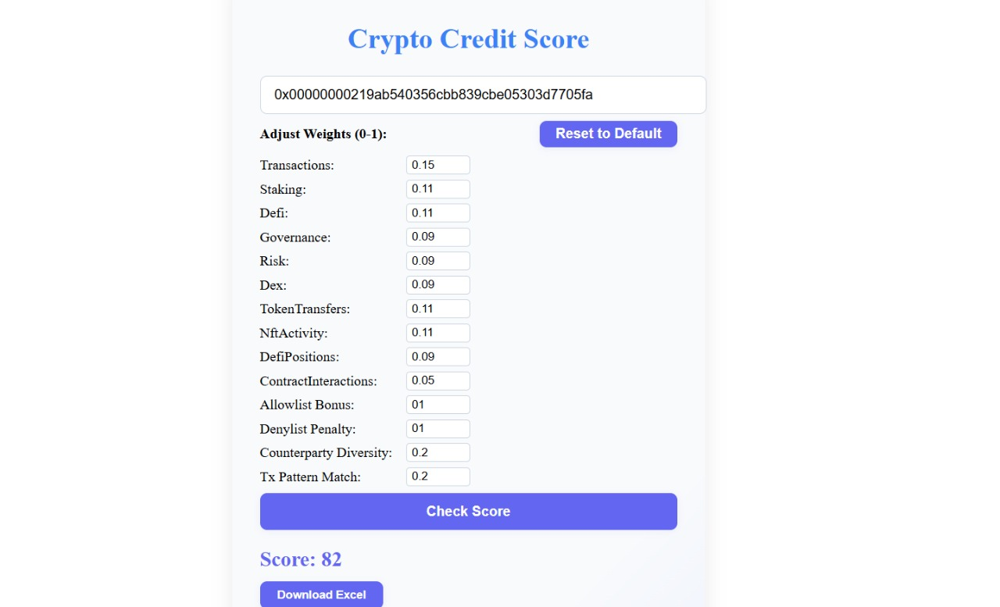
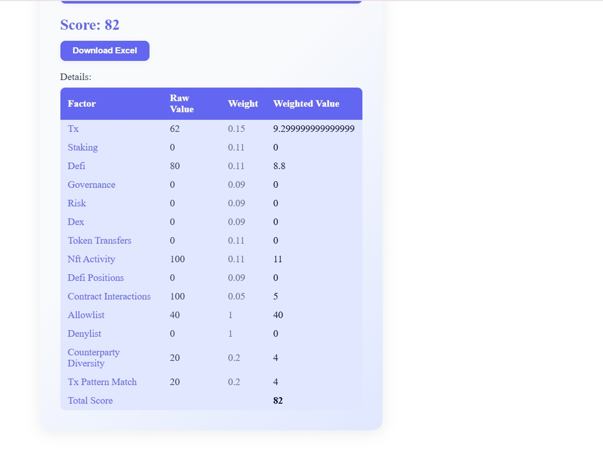

# webE: On-Chain Crypto Credit Score Protocol

## Purpose
webE is a protocol that aggregates on-chain user behavior—such as transaction history, staking habits, and DeFi interactions—into a transparent, trustable crypto credit score. This score encourages accountability and enables fairer financial decisions in the decentralized ecosystem.

## How It Works
- **Smart Contract**: Stores and updates user scores on-chain for transparency.
- **Scoring Engine**: Aggregates blockchain data (transaction volume, wallet age, staking, DeFi activity) and calculates a credit score using a transparent algorithm.
- **Backend API**: Serves the score calculation via an Express API.
- **Frontend**: React app lets users check their crypto credit score by entering an Ethereum address.

<h2>Demo</h2>
<p align="center">
  
  
</p>


## Features
- **Comprehensive Scoring**: 13 different on-chain behavior metrics
- **Real-time Data**: Uses Covalent API for live blockchain data
- **Threat Intelligence**: Auto-updating allowlist/denylist with 24h refresh
- **Transparent Algorithm**: Open-source scoring logic with detailed breakdowns
- **Adjustable Weights**: Frontend allows real-time weight customization
- **Excel Export**: Download detailed score analysis
- **Pattern Detection**: Recognizes legitimate transaction patterns (e.g., staking deposits)
- **Counterparty Analysis**: Measures interaction diversity for legitimacy scoring
- **Modern UI**: React frontend with responsive design
- **Easy Integration**: RESTful API for DeFi platform integration

## Setup Instructions

### Prerequisites
- Node.js (v18+ recommended)
- npm

### 1. Clone the Repository
```sh
git clone <your-repo-url>
cd webE
```

### 2. Install Dependencies
```sh
npm install
cd frontend
npm install
```

### 3. Set Up Covalent API
- Get a free API key from [Covalent](https://www.covalenthq.com/)
- Replace `YOUR_COVALENT_API_KEY` in `engine/score-engine.js` with your actual API key

### 4. Initialize Threat Intelligence Lists
```sh
node engine/listsUpdater.js
```
This creates the initial `lists.json` file with allowlist and denylist data.

### 5. Run the Backend (Express API)
```sh
node server.js
```
Backend runs on port 3001.

### 6. Run the Frontend (Vite React App)
```sh
cd frontend
npx vite
```
Frontend runs on port 3002.

### 7. Use the App
- Visit [http://localhost:3002](http://localhost:3002)
- Enter any Ethereum address to view its crypto credit score

## Project Structure
```
contracts/           # Solidity smart contracts
engine/              # Scoring engine (Node.js)
  score-engine.js    # Main scoring logic with 13 components
  listsUpdater.js    # Auto-updates threat intelligence lists
frontend/            # React frontend (Vite)
  src/
    ScoreChecker.jsx # Main UI with weight controls and Excel export
api/                 # Express API routes
  score.js          # Score calculation endpoint
server.js           # Express server with JSON middleware
lists.json          # Allowlist/denylist data (auto-generated)
```

## How the Scoring Works

### Data Source
All on-chain data is fetched from **Covalent API**, which provides comprehensive blockchain data including transactions, token balances, staking positions, and protocol interactions.

### 13 Scoring Components

#### 1. **Transaction Score** (15% weight)
- **Data**: Transaction history via Covalent `/transactions_v2/`
- **Logic**: 
  - Transaction count (40% of score)
  - Total ETH volume (40% of score)
  - Wallet age in months (20% of score)
- **Scale**: 0-100

#### 2. **Staking Score** (11% weight)
- **Data**: Staking positions via Covalent `/staking_positions/`
- **Logic**:
  - Total amount staked (60% of score)
  - Average staking duration (40% of score)
- **Scale**: 0-100

#### 3. **DeFi Score** (11% weight)
- **Data**: Token balances via Covalent `/balances_v2/`
- **Logic**:
  - Number of DeFi protocols used (50% of score)
  - NFTs owned (20% of score)
  - No liquidation history (30% of score)
- **Scale**: 0-100

#### 4. **Governance Score** (9% weight)
- **Data**: Activity events via Covalent `/activity/`
- **Logic**:
  - Votes cast in DAOs (70% of score)
  - Proposals made (30% of score)
- **Scale**: 0-100

#### 5. **Risk Score** (9% weight)
- **Data**: Activity events via Covalent `/activity/`
- **Logic**:
  - Oracle usage events (50% of score)
  - KYC verification status (30% of score)
  - Risk penalty for liquidations/flags (-20% of score)
- **Scale**: 0-100

#### 6. **DEX Score** (9% weight)
- **Data**: Transactions via Covalent `/transactions_v2/`
- **Logic**:
  - Number of DEX trades (60% of score)
  - DEX trading volume (40% of score)
- **Scale**: 0-100

#### 7. **Token Transfers Score** (11% weight)
- **Data**: Token transfers via Covalent `/transfers_v2/`
- **Logic**: Count of ERC20, ERC721, ERC1155, and other token transfers
- **Scale**: 0-100

#### 8. **NFT Activity Score** (11% weight)
- **Data**: NFT balances via Covalent `/balances_v2/?nft=true`
- **Logic**: Number of NFTs owned
- **Scale**: 0-100

#### 9. **DeFi Positions Score** (9% weight)
- **Data**: Token balances via Covalent `/balances_v2/`
- **Logic**: Count of active DeFi protocol positions
- **Scale**: 0-100

#### 10. **Contract Interactions Score** (5% weight)
- **Data**: Transactions via Covalent `/transactions_v2/`
- **Logic**: Number of unique smart contracts interacted with
- **Scale**: 0-100

#### 11. **Counterparty Diversity Score** (20% weight)
- **Data**: Transactions via Covalent `/transactions_v2/`
- **Logic**: Count unique senders + receivers, formula: `min((count/50), 1.0) * 20`
- **Scale**: 0-20

#### 12. **Transaction Pattern Match Score** (20% weight)
- **Data**: Transactions via Covalent `/transactions_v2/`
- **Logic**: Detects recurring value patterns (e.g., 32 ETH for Beacon deposits)
- **Scale**: 0 or 20 (if >70% inbound txs match known pattern)

#### 13. **Threat Intelligence Score** (40% allowlist, 50% denylist weight)
- **Data**: Local allowlist/denylist from `lists.json` (auto-updated from Etherscan and Chainabuse APIs)
- **Logic**:
  - Allowlist addresses: +40 points
  - Denylist addresses: -50 points (overrides other scores)
- **Scale**: -50 to +40

### Final Score Calculation
1. Each component score is multiplied by its weight
2. All weighted scores are summed
3. If address is on denylist, final score is forced to -50
4. If address is on allowlist, +40 bonus is added to the weighted sum
5. Result is rounded to nearest integer

### Auto-Updating Threat Intelligence
- **Allowlist**: Curated list of trusted addresses (exchanges, protocols)
- **Denylist**: Auto-updated from Chainabuse API for known malicious addresses
- **Update Frequency**: Every 24 hours via cron job

### Transparency Features
- All raw scores and weights are returned in API response
- Frontend displays detailed breakdown with adjustable weights
- Excel export functionality for analysis

## Customization
- **Scoring Weights**: Adjust weights in real-time via frontend or modify defaults in `engine/score-engine.js`
- **New Data Sources**: Add additional Covalent endpoints for more comprehensive scoring
- **Custom Patterns**: Add new transaction patterns in `getTxPatternMatchScore()` function
- **Threat Intel Sources**: Extend `engine/listsUpdater.js` to include additional threat intelligence feeds
- **Frontend Analytics**: Extend React components for additional visualizations and insights

## API Endpoints
- `POST /api/score` - Calculate credit score for an address
  - Body: `{"address": "0x...", "weights": {...}}`
  - Returns: `{"score": number, "details": "JSON string with breakdown"}`

## Test Addresses
- **High Diversity**: `0xe592427a0aece92de3edee1f18e0157c05861564` (Uniswap V3 Router)
- **Pattern Matching**: `0x00000000219ab540356cbb839cbe05303d7705fa` (Beacon Deposit Contract)
- **Allowlisted**: Any address in your allowlist for +40 bonus testing

## License
MIT
